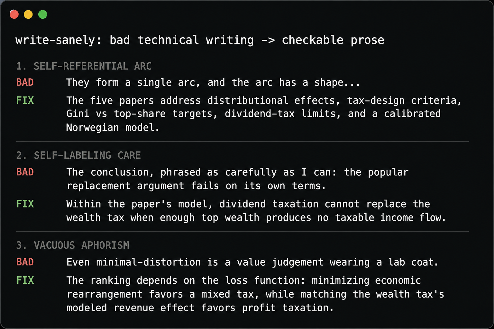

<div align="center">

# write-sanely

Personal writing skills for AI agents that need to produce clear, checkable, long-form technical prose.

[](https://github.com/EqualAPriori/write-sanely/stargazers)
[](https://github.com/EqualAPriori/write-sanely/actions/workflows/ci.yml)
[](LICENSE.md)

</div>


Are you going crazy from reading all this AI **** on your linkedin or from your colleagues? I know I am, and that this is only going to get worse in the near future. This is my little contribution to try to reclaim a bit of sanity from all this performative, crazy ai-writing that fails to communicate anything beyond, "The author didn't read this and it's not worth reading."

Give this to your colleagues' and friends' agents. You'll thank yourself for it. At this point this is not even about telling people to stop using AI to write. You know they're not going to stop. Just, for the love of ***, have AI write something that is worth your time. Friends don't let friends not `write-sanely`.




This repo's stance is: people spend too much time trying to hide "AI writing" and not enough time fixing the fact that much AI writing is structurally bad writing to begin with. The deeper problem is not only overused phrases, em dashes, polished sameness, or other surface tells. In longer technical work, the prose often fails at its real job: helping an external reader understand the claim, evidence, mechanism, scope, and consequence. It spends more time performing writing and talking to itself than communicating to the reader.

`write-sanely` helps agents audit and revise prose so it is specific, checkable, natural, and actually says something, instead of simply doing a shallow word-substitution pass.

Note: a good base of the content here is taken from Conor Bronsdon's excellent [avoid-ai-writing](https://github.com/conorbronsdon/avoid-ai-writing) skill, but then reorganized and supplemented with my experience from reviewing other long form technical content written by AI that drove me mad.


## What It Optimizes For

- Writing for a cold external reader, not for the author, the agent, or an internal draft history.
- Making claims checkable with concrete objects, sources, numbers, baselines, mechanisms, and limits.
- Fixing structure and evidence flow before cleaning up surface-level AI tells.
- Preserving useful technical detail instead of sanding prose into generic polish.
- Rewriting only what needs rewriting, and leaving already-good passages alone.

## Repository Layout

The current skill lives at:

```text
write-sanely/
  SKILL.md
  modules/
```

`SKILL.md` is the entry point. The modules cover workflow, severity, technical prose, structure, vocabulary tells, formatting, voice profiles, context profiles, captions, hard AI fingerprints, and rewrite playbooks.

## Use With Agents

This repo is meant to be portable. The simplest installation pattern is to clone the repo and place or symlink `write-sanely/` into your agent's skills directory.

For agents supported by `skills.sh`, install directly from the skill directory:

```sh
npx -y skills@latest add EqualAPriori/write-sanely/write-sanely
```

The `package.json` in this repo is for validation and release tooling only. It is not the runtime install path for the skill.

Cursor:

```sh
mkdir -p ~/.cursor/skills
ln -s "$(pwd)/write-sanely" ~/.cursor/skills/write-sanely
```

Claude Code:

```sh
mkdir -p ~/.claude/skills
ln -s "$(pwd)/write-sanely" ~/.claude/skills/write-sanely
```

OpenAI Codex:

```sh
mkdir -p ~/.agents/skills
ln -s "$(pwd)/write-sanely" ~/.agents/skills/write-sanely
```

Hermes:

```sh
mkdir -p ~/.hermes/skills/writing
ln -s "$(pwd)/write-sanely" ~/.hermes/skills/writing/write-sanely
```

If your agent does not support skills directly, paste or reference `write-sanely/SKILL.md` in the agent's project instructions and tell it to follow the module router.

## Development

Install tooling dependencies and run the skill/package validator:

```sh
npm install
npm run validate
```

The validator checks `write-sanely/SKILL.md` frontmatter, local Markdown links, and module references. CI runs the same validation on pull requests and `main`.

## Example Requests

- "Rewrite this section using the `write-sanely` skill."
- "Audit this draft for unclear claims and AI writing patterns."
- "Make this technical blog post work for a cold reader."
- "Edit this file in place, but preserve passages that already read well."

## License

MIT
